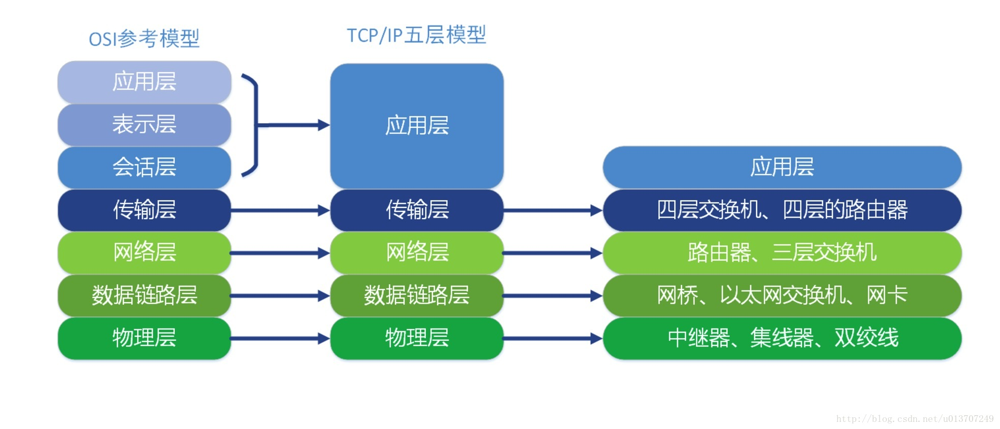
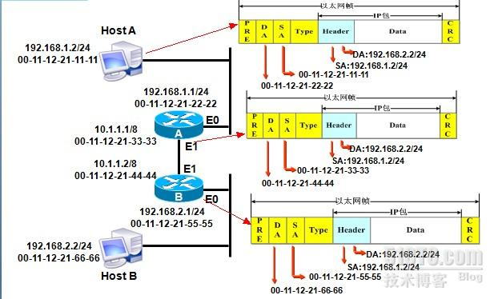
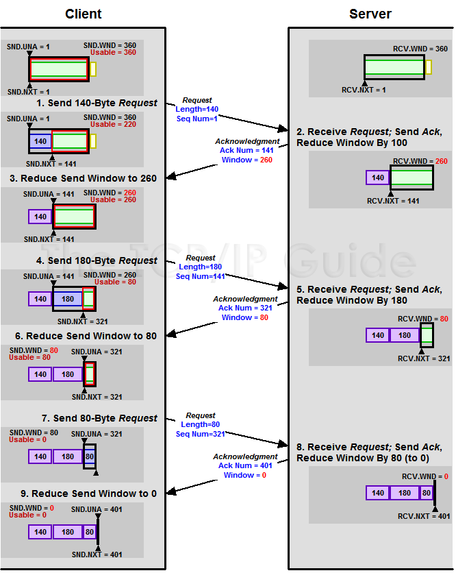

<!-- GFM-TOC -->
* [一、概述](#一概述)
    * [网络的网络](#网络的网络)
    * [ISP](#isp)
    * [主机之间的通信方式](#主机之间的通信方式)
    * [电路交换与分组交换](#电路交换与分组交换)
    * [时延](#时延)
    * [计算机网络体系结构*](#计算机网络体系结构)
* [二、物理层](#二物理层)
    * [通信方式](#通信方式)
    * [带通调制](#带通调制)
    * [信道复用技术](#信道复用技术)
* [三、数据链路层](#三数据链路层)
    * [信道分类](#信道分类)
    * [三个基本问题](#三个基本问题)
    * [局域网](#局域网)
    * [PPP 协议](#ppp-协议)
    * [CSMA/CD 协议*](#csmacd-协议)
    * [扩展局域网*](#扩展局域网)
    * [MAC 层*](#mac-层)
* [四、网络层*](#四网络层)
    * [网际协议 IP 概述](#网际协议-ip-概述)
    * [IP 数据报格式](#ip-数据报格式)
    * [IP 地址编址方式](#ip-地址编址方式)
    * [IP 地址和 MAC 地址](#ip-地址和-mac-地址)
    * [地址解析协议 ARP](#地址解析协议-arp)
    * [路由器的结构](#路由器的结构)
    * [路由器分组转发流程](#路由器分组转发流程)
    * [路由选择协议](#路由选择协议)
    * [网际控制报文协议 ICMP](#网际控制报文协议-icmp)
    * [分组网间探测 PING](#分组网间探测-ping)
    * [Traceroute](#traceroute)
    * [虚拟专用网 VPN](#虚拟专用网-vpn)
    * [网络地址转换 NAT](#网络地址转换-nat)
* [五、运输层*](#五运输层)
    * [UDP 和 TCP 的特点](#udp-和-tcp-的特点)
    * [UDP 首部格式](#udp-首部格式)
    * [TCP 首部格式](#tcp-首部格式)
    * [TCP 的三次握手](#tcp-的三次握手)
    * [TCP 的四次挥手](#tcp-的四次挥手)
    * [TCP 滑动窗口](#tcp-滑动窗口)
    * [TCP 可靠传输](#tcp-可靠传输)
    * [TCP 流量控制](#tcp-流量控制)
    * [TCP 拥塞控制](#tcp-拥塞控制)
* [六、应用层*](#六应用层)
    * [域名系统 DNS](#域名系统-dns)
    * [文件传输协议 FTP](#文件传输协议-ftp)
    * [远程终端协议 TELNET](#远程终端协议-telnet)
    * [电子邮件协议](#电子邮件协议)
    * [动态主机配置协议 DHCP](#动态主机配置协议-dhcp)
    * [点对点传输 P2P](#点对点传输-p2p)
    * [Web 页面请求过程](#web-页面请求过程)
    * [常用端口](#常用端口)
* [参考资料](#参考资料)
<!-- GFM-TOC -->


# 一、概述

## 网络的网络

网络把主机连接起来，而互联网是把多种不同的网络连接起来，因此互联网是网络的网络。

<div align="center">  </div><br>

## ISP (Internet Service Provider)

互联网服务提供商 ISP 可以从互联网管理机构获得许多 IP 地址，同时拥有通信线路以及路由器等联网设备，个人或机构向 ISP 缴纳一定的费用就可以接入互联网。

<div align="center">  </div><br>

目前的互联网是一种多层次 ISP 结构，ISP 根据覆盖面积的大小分为第一层 ISP、区域 ISP 和接入 ISP。

互联网交换点 IXP 允许两个 ISP 直接相连而不用经过第三个 ISP。

<div align="center">  </div><br>


## 主机之间的通信方式

- 客户-服务器（C/S）：客户是服务的请求方，服务器是服务的提供方。

- 对等（P2P）：不区分客户和服务器。

<div align="center">  </div><br>

## 电路交换与分组交换

<div align="center">  </div><br>

（以上分别为：电路交换、报文交换以及分组交换）

### 1. 电路交换

(eg. 打电话) 两个用户要建立一条专用的物理链路。  
过程：建立连接(占用通信资源)->通话(一直占用通信资源)->释放连接(归还通信资源)。  
利用率很低,由于在网络中，数据的发送与传输都是突发式的，所以电路交换并不适用于计算机的数据传送。

### 2. 报文交换

报文时指计算机要发送或接受的那一串数据。它采用的是 **存储转发** 技术，即在各个路由器之间存储再转发，不需要占用端到端的线路。 (eg.邮局寄信)。  
更加适合计算机的数据传输。即发即用。   
但是传输的数据过大的话，会造成大量的时延，使得传输效率低。

### 3. 分组交换

建立在 **报文交换** 基础上的一种改进，也是采用 **存储转发** 方式进行。  
完美地解决: `报文交换 传输的数据量过大会导致时延增加，并且对路由器和交换机的性能也有要求`的问题。  
对报文分组，同时在数据段的前面加上控制消息组成了首部，来识别哪些分组是一个整体的报文。
由于分组比报文更小，因此分组交换的存储转发速度更加快速。

Refer to [电路交换、报文交换和分组交换](https://blog.csdn.net/move_now/article/details/52658470)

## 时延

总时延 = 处理时延（发送处理中） + 排队时延（发送等待） + 发送时延（发送） + 传播时延（传播）  

（发送情境中）
<div align="center">  </div><br>

1. 发送时延： 主机或路由器发送数据帧所需要的时间。
2. 传播时延： 电磁波在信道中传播一定的距离需要花费的时间，电磁波传播速度接近光速。
3. 处理时延： 主机或路由器收到分组时进行处理所需要的时间，例如分析首部、从分组中提取数据、进行差错检验或查找适当的路由等。
4. 排队时延： 分组在路由器的输入队列和输出队列中排队等待的时间，取决于网络当前的通信量。

## 计算机网络体系结构*

### 0. 按照设备类型，OSI七层模型与五层的横向对比:
Refer to https://blog.csdn.net/u013707249/article/details/77848477

<div align="center">  </div><br>

<div align="center">  </div><br>

<div align="center">  </div><br>

Refer to https://www.cnblogs.com/gdayq/p/5797645.html

<div align="center">  </div><br>

### 1. 五层协议

- 应用层：为特定**应用程序**提供数据传输服务。数据单位为报文。  
    常见的HTTP，SMTP,FTP都是属于应用层的实现。

- 运输层：提供的是**进程间**的通用数据传输服务。定义通用的运输层协议可以支持不断增多的应用层协议。  
    运输层包括两种协议：TCP 主要提供完整性服务，UDP 主要提供及时性服务。
    - 传输控制协议 TCP，提供面向连接、可靠的数据传输服务，数据单位为报文段；
    - 用户数据报协议 UDP，提供无连接、尽最大努力的数据传输服务，数据单位为用户数据报。   

- 网络层：(IP)为**主机**之间提供数据传输服务。网络层把运输层传递下来的报文段或者用户数据报封装成分组。

- 数据链路层：链路层就是一个决定以什么样的方式来传输网络上流动的数据包。比如网卡设备，路由器。  
网络层针对的还是主机之间的数据传输服务，而主机之间可以有很多链路，链路层协议就是为同一链路的节点提供服务。数据链路层把网络层传来的分组封装成帧。

- 物理层：在网络通信中支持网络传输的设备，中继器，双绞线。(遵循硬件通信协议)   
  考虑的是怎样在传输媒体上传输数据比特流，而不是指具体的传输媒体。   
  物理层的作用是尽可能屏蔽传输媒体和通信手段的差异，使数据链路层感觉不到这些差异。

五层协议没有表示层和会话层，而是将这些功能留给应用程序开发者处理。

### 2. 七层协议

其中表示层和会话层用途如下：

- 表示层：数据压缩、加密以及数据描述。这使得应用程序不必担心在各台主机中表示/存储的内部格式不同的问题。
- 会话层：建立及管理会话和终止表示层实体之间的通信会话。该层的通信由不同设备中的应用程序之间的服务请求和响应组成。

HINT: 每次的网络通信都可以称之为一次会话，我们知道http是无状态（stateless）的连接，每次连接不会被记录。但是http1.0出来的规范里，keep-live的出现，可以让每一次的连接不会被过早的中断。这些其实都是在会话层做的处理。

### 3. 数据在各层之间的传递过程

在向下的过程中，需要添加下层协议所需要的首部或者尾部，而在向上的过程中不断拆开首部和尾部。

路由器只有下面三层协议(最高到网络层)，因为路由器位于网络核心中，不需要为进程或者应用程序提供服务，因此也就不需要运输层和应用层。

<div align="center">  </div><br>

### 4. TCP/IP 体系结构

它只有四层，相当于五层协议中数据链路层和物理层合并为网络接口层。

现在的 TCP/IP 体系结构不严格遵循 OSI 分层概念，**应用层可能会直接使用 IP 层或者网络接口层**。

<div align="center">  </div><br>

TCP/IP 协议族是一种沙漏形状，中间小两边大，IP 协议在其中占用举足轻重的地位。

<div align="center">  </div><br>


# 二、物理层

## 通信方式

- 单向通信，又称为单工通信；
- 双向交替通信，又称为半双工通信；
- 双向同时通信，又称为全双工通信。

## 带通调制

模拟信号是连续的信号，数字信号是离散的信号。带通调制把数字信号转换为模拟信号。

<div align="center">  </div><br>

## 信道复用技术

### 1. 频分复用、时分复用

频分复用的所有用户在相同的时间占用不同的频率带宽资源；时分复用的所有用户在不同的时间占用相同的频率带宽资源。

使用这两种方式进行通信，在通信的过程中用户会一直占用一部分信道资源。但是由于计算机数据的突发性质，通信过程没必要一直占用信道资源而不让出给其它用户使用，因此这两种方式对信道的利用率都不高。

<div align="center">  </div><br>

### 2. 统计时分复用

是对时分复用的一种改进，不固定每个用户在时分复用帧中的位置，只要有数据就集中起来组成统计时分复用帧然后发送。

<div align="center">  </div><br>

### 3. 波分复用

光的频分复用。由于光的频率很高，因此习惯上用波长而不是频率来表示所使用的光载波。

<div align="center">  </div><br>

### 4. 码分复用

为每个用户分配 m bit 的码片，并且所有的码片正交，对于任意两个码片  和  有

<div align="center"></div> <br>

为了讨论方便，取 m=8，设码片  为 00011011。在拥有该码片的用户发送比特 1 时就发送该码片，发送比特 0 时就发送该码片的反码 11100100。

在计算时将 00011011 记作 (-1 -1 -1 +1 +1 -1 +1 +1)，可以得到

<div align="center"></div> <br>

<div align="center"></div> <br>

其中  为  的反码。

利用上面的式子我们知道，当接收端使用码片  对接收到的数据进行内积运算时，结果为 0 的是其它用户发送的数据，结果为 1 的是用户发送的比特 1，结果为 -1 的是用户发送的比特 0。

码分复用需要发送的数据量为原先的 m 倍。

<div align="center">  </div><br>

# 三、数据链路层

## 信道分类

- 点对点信道：一对一通信方式；
- 广播信道：一对多通信方式。

## 三个基本问题

### 1. 封装成帧

将网络层传下来的分组添加首部和尾部，用于标记帧的开始和结束。

<div align="center">  </div><br>

### 2. 透明传输

透明表示一个实际存在的事物看起来好像不存在一样。

帧使用首部和尾部进行定界，如果帧的数据部分含有和首部尾部相同的内容，那么帧的开始和结束位置就会被错误的判定。需要在数据部分出现首部尾部相同的内容前面插入转义字符，如果出现转义字符，那么就在转义字符前面再加个转义字符，在接收端进行处理之后可以还原出原始数据。这个过程透明传输的内容是转义字符，用户察觉不到转义字符的存在。

<div align="center">  </div><br>

### 3. 差错检测

目前数据链路层广泛使用了循环冗余检验（CRC）来检查比特差错。

## 局域网

局域网是典型的一种广播信道，主要特点是网络为一个单位所拥有，且地理范围和站点数目均有限。

可以按照网络拓扑对局域网进行分类：

<div align="center">  </div><br>

## PPP 协议

用于点对点信道中。互联网用户通常需要连接到某个 ISP 之后才能接入到互联网，PPP 协议是用户计算机和 ISP 进行通信时所使用的数据链路层协议。

<div align="center">  </div><br>

在 PPP 的帧中：

- F 字段为帧的定界符
- A 和 C 字段暂时没有意义
- FCS 字段是使用 CRC 的检验序列
- 信息部分的长度不超过 1500

<div align="center">  </div><br>

## CSMA/CD 协议*

用于广播信道中。在广播信道上，同一时间只能允许一台计算机发送数据。

CSMA/CD 表示载波监听多点接入 / 碰撞检测。

-  **多点接入** ：说明这是总线型网络，许多计算机以多点的方式连接到总线上。
-  **载波监听** ：每个站都必须不停地监听信道。在发送前，如果监听到信道正在使用，就必须等待。
-  **碰撞检测** ：在发送中，如果监听到信道已有其它站正在发送数据，就表示发生了碰撞。虽然每一个站在发送数据之前都已经监听到信道为空闲，但是由于电磁波的传播时延的存在，还是有可能会发生碰撞。

<div align="center">  </div><br>

记端到端的传播时延为 τ，最先发送的站点最多经过 2τ 就可以知道是否发生了碰撞，称 2τ 为  **争用期** 。只有经过争用期之后还没有检测到碰撞，才能肯定这次发送不会发生碰撞。

当发生碰撞时，站点要停止发送，等待一段时间再发送。这个时间采用  **截断二进制指数退避算法**  来确定，从离散的整数集合 {0, 1, .., (2<sup>k</sup>-1)} 中随机取出一个数，记作 r，然后取 r 倍的争用期作为重传等待时间。

## 扩展局域网*

### 1. 在物理层进行扩展

使用集线器进行扩展。

集线器的主要功能是对接收到的信号进行放大，以扩大网络的传输距离。

集线器不能根据 MAC 地址进行转发，而是以广播的方式发送数据帧。

集线器是一种共享式的传输设备，意味着同一时刻只能传输一组数据帧。

<div align="center">  </div><br>

### 2. 在链路层进行扩展

最开始使用的是网桥，它收到一个帧时，根据帧的 MAC 地址，查找网桥中的地址表，确定帧转发的接口。

网桥不是共享式设备，因此性能比集线器这种共享式设备更高。

交换机的问世很快就淘汰了网桥，它实质上是一个多接口网桥，而网桥是两接口。交换机的每个接口都能直接与一个主机或者另一个交换机相连，并且一般都工作在全双工方式。

交换机具有自学习能力，学习的是交换表的内容。交换表中存储着 MAC 地址到接口的映射。下图中，交换机有 4 个接口，主机 A 向主机 B 发送数据帧时，交换机把主机 A 到接口 1 的映射写入交换表中。为了发送数据帧到 B，先查交换表，此时没有主机 B 的表项，那么主机 A 就发送广播帧，主机 C 和主机 D 会丢弃该帧。主机 B 收下之后，查找交换表得到主机 A 映射的接口为 1，就发送数据帧到接口 1，同时交换机添加主机 B 到接口 3 的映射。

<div align="center">  </div><br>

### 3. 虚拟局域网

虚拟局域网可以建立与物理位置无关的逻辑组，只有在同一个虚拟局域网中的成员才会收到链路层广播信息，例如下图中 (A1, A2, A3, A4) 属于一个虚拟局域网，A1 发送的广播会被 A2、A3、A4 收到，而其它站点收不到。

<div align="center">  </div><br>

## MAC 层*+

MAC 地址是 6 字节（48 位）的地址，用于唯一标识网络适配器（网卡），一台主机拥有多少个适配器就有多少个 MAC 地址，例如笔记本电脑普遍存在无线网络适配器和有线网络适配器。

<div align="center">  </div><br>

在 MAC 帧中：

-  **类型** ：标记上层使用的协议；
-  **数据** ：长度在 46-1500 之间，如果太小则需要填充；
-  **FCS** ：帧检验序列，使用的是 CRC 检验方法；
-  **前同步码** ：只是为了计算 FCS 临时加入的，计算结束之后会丢弃。

# 四、网络层* +

## 网际协议 IP 概述

因为网络层是整个互联网的核心，因此应当让网络层尽可能简单。网络层向上只提供简单灵活的、无连接的、尽最大努力交互的数据报服务。

使用 IP 协议，可以把异构的物理网络连接起来，使得在网络层看起来好像是一个统一的网络。

<div align="center">  </div><br>

与 IP 协议配套使用的还有三个协议(同一层)：

- 地址解析协议 ARP（Address Resolution Protocol）
- 网际控制报文协议 ICMP（Internet Control Message Protocol）
- 网际组管理协议 IGMP（Internet Group Management Protocol）

<div align="center">  </div><br>

## IP 数据报格式

<div align="center">  </div><br>

-  **版本**  : 有 4（IPv4）和 6（IPv6）两个值；

-  **首部长度**  : 占 4 位，因此最大值为 15。值为 1 表示的是 1 个 32 位字的长度，也就是 4 字节。因为首部固定长度为 20 字节，因此该值最小为 5。如果可选字段的长度不是 4 字节的整数倍，就用尾部的填充部分来填充。

-  **区分服务**  : 用来获得更好的服务，一般情况下不使用。

-  **总长度**  : 包括首部长度和数据部分长度。

-  **标识**  : 在数据报长度过长从而发生分片的情况下，相同数据报的不同分片具有相同的标识符。

-  **片偏移**  : 和标识符一起，用于发生分片的情况。片偏移的单位为 8 字节。

<div align="center">  </div><br>

-  **生存时间**  ：TTL，它的存在是为了防止无法交付的数据报在互联网中不断兜圈子。以路由器跳数为单位，当 TTL 为 0 时就丢弃数据报。

-  **协议** ：指出携带的数据应该上交给哪个协议进行处理，例如 ICMP、TCP、UDP 等。

-  **首部检验和** ：因为数据报每经过一个路由器，都要重新计算检验和，因此检验和不包含数据部分可以减少计算的工作量。

## IP 地址编址方式

IP 地址的编址方式经历了三个历史阶段：

- 分类
- 子网划分
- 无分类

### 1. 分类

由两部分组成，网络号和主机号，其中不同分类具有不同的网络号长度，并且是固定的。

IP 地址 ::= {< 网络号 >, < 主机号 >}

<div align="center">  </div><br>

### 2. 子网划分

通过在主机号字段中拿一部分作为子网号，把两级 IP 地址划分为三级 IP 地址。注意，外部网络看不到子网的存在。

IP 地址 ::= {< 网络号 >, < 子网号 >, < 主机号 >}

要使用子网，必须配置子网掩码。一个 B 类地址的默认子网掩码为 255.255.0.0，如果 B 类地址的子网占两个比特，那么子网掩码为 11111111 11111111 11000000 00000000，也就是 255.255.192.0。

### 3. 无分类(CIDR)

无分类编址 CIDR 消除了传统 A 类、B 类和 C 类地址以及划分子网的概念，使用网络前缀和主机号来对 IP 地址进行编码，网络前缀的长度可以根据需要变化。

IP 地址 ::= {< 网络前缀号 >, < 主机号 >}

CIDR 的记法上采用在 IP 地址后面加上网络前缀长度的方法，例如 128.14.35.7/20 表示前 20 位为网络前缀。

CIDR 的地址掩码可以继续称为子网掩码，子网掩码首 1 长度为网络前缀的长度。

一个 CIDR 地址块中有很多地址，一个 CIDR 表示的网络就可以表示原来的很多个网络，并且在路由表中只需要一个路由就可以代替原来的多个路由，减少了路由表项的数量。把这种通过使用网络前缀来减少路由表项的方式称为路由聚合，也称为  **构成超网** 。

在路由表中的项目由“网络前缀”和“下一跳地址”组成，在查找时可能会得到不止一个匹配结果，应当采用最长前缀匹配来确定应该匹配哪一个。

## IP 地址和 MAC 地址 *** ???

#### 数据包在网络传输中，每到一个路由器，MAC都会解封，并用新的MAC封包。但是 IP包整体不变。
#### ??? 可是路由器有IP阿。难道，路由器维护 IP：MAC 的匹配，用IP找到下一跳，然后直接用其对应的MAC封包？

网络层实现主机之间的通信，而链路层实现具体每段链路之间的通信。因此在通信过程中，IP 数据报的源地址和目的地址始终不变，而 MAC 地址随着链路的改变而改变。

<div align="center">  </div><br>

## 地址解析协议 ARP

实现由 IP 地址得到 MAC 地址。

<div align="center">  </div><br>

每个主机都有一个`ARP 高速缓存`，里面有**本局域网**上的各**主机和路由器**的 IP 地址到硬件地址的映射表。

如果主机 A 知道主机 B 的 IP 地址，但是 ARP 高速缓存中没有该 IP 地址到 MAC 地址的映射:

#### 主机 A 通过`广播`发送 ARP Req:
> IP: D: B IP; S: A IP;   
 MAC: D: FF:...:FF ; S: A's MAC;

#### 主机 B 收到该请求后(发现Dip是自己)，发送 ARP 响应分组给主机 A: (告知其 MAC 地址)
> IP: D: A IP; S: B IP;   
 MAC: D: A's MAC, S: B's MAC;

#### 主机 A 向其高速缓存中写入主机 B 的 IP 地址到 MAC 地址的映射。

<div align="center">  </div><br>

## 路由器的结构

路由器从功能上可以划分为：路由选择和分组转发。

#### 路由器的详细工作xx:
<div align="center">  </div><br>

#### Comments:
路由转发中，IP包整体不会发生改变。
路由选择: 根据 IP包的DesIP, 找到 下一跳的IP，用DesIP对应的MAC封包.（所以路由是在第三层-IP层）  
分组转发：封号的MAC包，发出去。（所以路由是在第二层-数据链路层）  
二层交换机就只是工作在第二层，转发MAC包。不touch里面的IP包。  
三层交换机有路由功能，像路由器一样，会重新封MAC包啦。  
**ALL RIGHT!**


分组转发结构由三个部分组成：交换结构、一组输入端口和一组输出端口。

<div align="center">  </div><br>

### Diff 路由表 & 转发表
路由表： 路由条目s
转发表： MAC地址和端口的map

### 路由器 - 分组转发流程
> ##### Comment: Base on 路由表, 来转发包。

- 从数据报的首部提取目的主机的 IP 地址 D，得到目的网络地址 N。
- 若 N 就是与此路由器直接相连的某个网络地址，则进行直接交付；
- 若路由表中有目的地址为 D 的特定主机路由，则把数据报传送给表中所指明的下一跳路由器；
- 若路由表中有到达网络 N 的路由，则把数据报传送给路由表中所指明的下一跳路由器；
- 若路由表中有一个默认路由，则把数据报传送给路由表中所指明的默认路由器；
- 报告转发分组出错。

<div align="center">  </div><br>

### 路由器 - 路由选择协议

> ##### 路由选择协议:  
> 目标是实现路由表中路由信息的动态更新.    
> 路由选择协议的核心是路由算法。

互联网使用的路由选择协议都是自适应的，能随着网络通信量和拓扑结构的变化而自适应地进行调整。

互联网可以划分为许多较小的自治系统 AS，一个 AS 可以使用一种和别的 AS 不同的路由选择协议。

可以把路由选择协议划分为两大类：

- 内部网关协议 IGP（Interior Gateway Protocol）：在 AS 内部使用，如 RIP 和 OSPF。
- 外部网关协议 EGP（External Gateway Protocol）：在 AS 之间使用，如 BGP。

<div align="center">  </div><br>

#### 1. 内部网关协议 RIP

RIP 是一种分布式的基于距离向量的路由选择协议。距离是指跳数，直接相连的路由器跳数为 1，跳数最多为 15，超过 15 表示不可达。

RIP 按固定的时间间隔仅和相邻路由器交换自己的路由表，经过若干次交换之后，所有路由器最终会知道到达本自治系统中任何一个网络的最短距离和下一跳路由器地址。

距离向量算法：

- 对地址为 X 的相邻路由器发来的 RIP 报文，先修改报文中的所有项目，把下一跳字段中的地址改为 X，并把所有的距离字段加 1；
- 对修改后的 RIP 报文中的每一个项目，进行以下步骤：
 - 若原来的路由表中没有目的网络 N，则把该项目添加到路由表中；
 - 否则：若下一跳路由器地址是 X，则把收到的项目替换原来路由表中的项目；否则：若收到的项目中的距离 d 小于路由表中的距离，则进行更新（例如原始路由表项为 Net2, 5, P，新表项为 Net2, 4, X，则更新）；否则什么也不做。
- 若 3 分钟还没有收到相邻路由器的更新路由表，则把该相邻路由器标为不可达，即把距离置为 16。

RIP 协议实现简单，开销小，但是 RIP 能使用的最大距离为 15，限制了网络的规模。并且当网络出现故障时，要经过比较长的时间才能将此消息传送到所有路由器。

#### 2. 内部网关协议 OSPF

开放最短路径优先 OSPF，是为了克服 RIP 的缺点而开发出来的。

开放表示 OSPF 不受某一家厂商控制，而是公开发表的；最短路径优先表示使用了 Dijkstra 提出的最短路径算法 SPF。

OSPF 具有以下特点：

- 向本自治系统中的所有路由器发送信息，这种方法是洪泛法。
- 发送的信息就是与相邻路由器的链路状态，链路状态包括与哪些路由器相连以及链路的度量，度量用费用、距离、时延、带宽等来表示。
- 只有当链路状态发生变化时，路由器才会发送信息。

所有路由器都具有全网的拓扑结构图，并且是一致的。相比于 RIP，OSPF 的更新过程收敛的很快。

#### 3. 外部网关协议 BGP

AS 之间的路由选择很困难，主要是因为互联网规模很大。并且各个 AS 内部使用不同的路由选择协议，就无法准确定义路径的度量。并且 AS 之间的路由选择必须考虑有关的策略，比如有些 AS 不愿意让其它 AS 经过。

BGP 只能寻找一条比较好的路由，而不是最佳路由。它采用路径向量路由选择协议。

每个 AS 都必须配置 BGP 发言人，通过在两个相邻 BGP 发言人之间建立 TCP 连接来交换路由信息。

<div align="center">  </div><br>

## 交换机

### MAC地址表: 局域网主机MAC地址与交换机接口的map.

### 交换机的工作原理:
交换机是通过MAC地址通信. 工作在链路层喽。
维护一个 **MAC地址表** 。
然后根据MAC地址表直接转发数据帧的。(MAC包)
So, 传说中的二层交换机(不用网管的话)本身可以没有MAC地址。

#### 二层交换机
在局域网上， 二层交换机通过源MAC地址来标识数据包的发送者，根据目的MAC 地址来转发数据包。  
对于一个目的地址不在本局域网上的MAC包，二层交换机不可能直接把它送到目的地，需要通过路由设备(比如传统的路由器)来转发: 这时就要把交换机连接到路由设备上。  
如果把交换机的缺省网关设置为路由设备的IP地址，交换机会把需要经过路由转发的包送到路由设备上。

##### 三层交换机的优势 v.s. 路由器   
三层交换机也具有一定的“路由”功能，可以实现不同子网的连接。
> 路由设备检查数据包的目的地址和自己的路由表，如果在路由表中找到转发路径，路由设备把该数据包转发到其它的网段上，否则，丢弃该数据包。专用路由器昂 贵、复杂、速度慢、易成为网络瓶颈，因为它要分析所有的广播包并转发其中的一部分，还要和其它的路由器交换路由信息，而且这些处理过程都是由CPU 来处理的(不是专用的ASIC )。   
第三层交换机既能像二层交换机那样通过MAC 地址来标识转发数据包，也能像传统路由器那样在两个网段之间进行路由转发。传统路由器采用软件来维护路由表，而三层交换机是通过专用的ASIC芯片来处理 路由转发的。与传统路由器相比，第三层交换机的路由速度一般要快十倍或数十倍。


## 网际控制报文协议 ICMP

用处-目的：ICMP 是为了更有效地转发 IP 数据报和提高交付成功的机会。  
??? 它封装在 IP 数据报中，但是不属于高层协议。(What do you mean by `封装在 IP 数据报中`? )
总之，是一个网络层的包。

<div align="center">  </div><br>

ICMP 报文分为差错报告报文和询问报文。

<div align="center">  </div><br>

### ICMP应用 - PING（分组网间探测 ）

PING 是 ICMP 的一个重要应用，主要用来测试两台主机之间的连通性。

Ping 发送的 IP 数据报封装的是无法交付的 UDP 用户数据报。（从下面的流程看，这个UDP的说法是对的。）

#### PING的流程:

假设有两台主机`PC1`和`PC2`，如下：

```code
         PC1－－－－－－－－－－－－PC2     
         IP：192.168.1.1      IP：192.168.1.2
```

`Ping`的过程如下：
> - `PC1`在应用层发起个目标`IP`为`192.168.1.2`的`Ping`请求。
> - => 直接使用网际层(IP层)的`ICMP`协议，不经过传输层(TCP/UDP)。
> - 网际层接收来处上层的数据后，封装成ICMP数据包。根据`ICMP`协议进行封装，添加`PC1`的`IP`为源`IP`和`PC2`的`IP`为目标`IP`。下传到网络接口层。
> - 网络接口层接收ICMP包后，封装成MAC包。源`MAC`地址为`PC1`的`MAC`地址，目标`MAC`地址(则查询自己的`ARP`缓存表获取)。是`PC2`的`MAC`地址。发给下层进行网络传输。
>> Get the ARP table updated:
>> - 如果`PC1`的`ARP`缓存表中没有目标`IP`对应的`MAC`地址，则`PC1`发出一个`ARP`广播报文。`ARP`报文中源`MAC`地址为`PC1`的`MAC`地址，源`IP`地址为`PC1`的`IP`，所要请求的是`PC2`的`IP`对应的`MAC`地址。
>> - `PC2`收到`ARP`广播后，进行解封装，发现所请求的`MAC`地址是自己的。则`PC2`将`PC1`的`MAC`地址写入`ARP`缓存表中。然后向`PC1`发送一个 `ARP`应答单播。该单播消息包括目标`IP`为`PC1`的`IP`，目标`MAC`为`PC1`的`MAC`地址，源`IP`为`PC2`的`IP`，源`MAC`为`PC2`的`MAC`。
>> - `PC1`接收到`PC2`的`ARP`应答报文后，将`PC2`的`MAC`地址存入`ARP`缓存中.
> - `PC2`接收这个帧后，在网络接口层查看目标`MAC`地址是否指向自己。是，`PC2`则将帧头去掉，向上层传输。
> - `PC2`网际层接收到这个信息包，查看包头，发现目标`IP`和自己匹配，则解封装，将数据向上层传输。
> - 传输层接收来自下层的`Ping`请求的`UDP`报文，则去掉`UDP`报头，向应用层传送。（说好的不经过传输层包装呢？？？可能是随意包个UDP的头来凑格式。）
> - 应用层收到`Ping`请求后，发送一个`Ping`回应报文给`PC1`。

Refer to https://blog.csdn.net/sinat_32487221/article/details/55272357


### ICMP应用 - Traceroute

Traceroute 是 ICMP 的另一个应用，用来跟踪一个分组从源点到终点的路径。

（机智的操作）
- 源主机向目的主机发送一连串的 IP 数据报。第一个数据报 P1 的生存时间 TTL 设置为 1，当 P1 到达路径上的第一个路由器 R1 时，R1 收下它并把 TTL 减 1，此时 TTL 等于 0，R1 就把 P1 丢弃，并向源主机发送一个 ICMP 时间超过差错报告报文；
- 源主机接着发送第二个数据报 P2，并把 TTL 设置为 2。P2 先到达 R1，R1 收下后把 TTL 减 1 再转发给 R2，R2 收下后也把 TTL 减 1，由于此时 TTL 等于 0，R2 就丢弃 P2，并向源主机发送一个 ICMP 时间超过差错报文。
- 不断执行这样的步骤，直到最后一个数据报刚刚到达目的主机，主机不转发数据报，也不把 TTL 值减 1。但是因为数据报封装的是无法交付的 UDP，因此目的主机要向源主机发送 ICMP 终点不可达差错报告报文。
- 之后源主机知道了到达目的主机所经过的路由器 IP 地址以及到达每个路由器的往返时间。


#### Q：??? 这个 `无法交付的 UDP` 是啥意思？ 是通过 UDP包中故意缺点啥，主动使其不可交付。还是咋嘀？怎麼做到让目的主机 发送 ICMP `终点不可达差错报告报文`的？
 难道`终点不可达`是因为 没有做 UDP包 封装，或者封装时没写D-port?
#### A: ???

## 虚拟专用网 VPN

由于 IP 地址的紧缺，一个机构能申请到的 IP 地址数往往远小于本机构所拥有的主机数。并且一个机构并不需要把所有的主机接入到外部的互联网中，机构内的计算机可以使用仅在本机构有效的 IP 地址（专用地址）。

有三个专用地址块：

- 10.0.0.0 \~ 10.255.255.255
- 172.16.0.0 \~ 172.31.255.255
- 192.168.0.0 \~ 192.168.255.255

VPN 使用公用的互联网作为本机构各专用网之间的通信载体。专用指机构内的主机只与本机构内的其它主机通信；虚拟指“好像是”，而实际上并不是，它有经过公用的互联网。

下图中，场所 A 和 B 的通信经过互联网，如果场所 A 的主机 X 要和另一个场所 B 的主机 Y 通信，IP 数据报的源地址是 10.1.0.1，目的地址是 10.2.0.3。数据报先发送到与互联网相连的路由器 R1，R1 对内部数据进行加密，然后重新加上数据报的首部，源地址是路由器 R1 的全球地址 125.1.2.3，目的地址是路由器 R2 的全球地址 194.4.5.6。路由器 R2 收到数据报后将数据部分进行解密，恢复原来的数据报，此时目的地址为 10.2.0.3，就交付给 Y。

<div align="center">  </div><br>

## 网络地址转换 NAT

专用网内部的主机使用本地 IP 地址又想和互联网上的主机通信时，可以使用 NAT 来将本地 IP 转换为全球 IP。

在以前，NAT 将本地 IP 和全球 IP 一一对应，这种方式下拥有 n 个全球 IP 地址的专用网内最多只可以同时有 n 台主机接入互联网。为了更有效地利用全球 IP 地址，现在常用的 NAT 转换表把运输层的端口号也用上了，使得多个专用网内部的主机共用一个全球 IP 地址。使用端口号的 NAT 也叫做网络地址与端口转换 NAPT。

<div align="center">  </div><br>

# 五、运输层*

网络层只把分组发送到目的主机，但是真正通信的并不是主机而是主机中的进程。运输层提供了进程间的逻辑通信，运输层向高层用户屏蔽了下面网络层的核心细节，使应用程序看见的好像在两个运输层实体之间有一条端到端的逻辑通信信道。

## UDP 和 TCP 的特点

- 用户数据报协议 UDP（User Datagram Protocol）是无连接的，尽最大可能交付，没有拥塞控制，面向报文（对于应用程序传下来的报文不合并也不拆分，只是添加 UDP 首部）。

- 传输控制协议 TCP（Transmission Control Protocol）是面向连接的，提供可靠交付，有流量控制，拥塞控制，提供全双工通信，面向字节流（把应用层传下来的报文看成字节流，把字节流组织成大小不等的数据块）。

## UDP 首部格式

<div align="center">  </div><br>

首部字段只有 8 个字节，包括源端口、目的端口、长度、检验和。12 字节的伪首部是为了计算检验和临时添加的。

## TCP 首部格式

<div align="center">  </div><br>

-  **序号**  ：(发送数据字节流的第一个字节的编号) 用于对字节流进行编号，例如序号为 301，表示第一个字节的编号为 301，如果携带的数据长度为 100 字节，那么下一个报文段的序号应为 401。

-  **确认号**  ：(期望收到的数据字节流的第一个字节的编号)期望收到的下一个报文段的序号。例如 B 正确收到 A 发送来的一个报文段，序号为 501，携带的数据长度为 200 字节，因此 B 期望下一个报文段的序号为 701，B 发送给 A 的确认报文段中确认号就为 701。

-  **数据偏移**  ：指的是数据部分距离报文段起始处的偏移量，**实际上指的是首部的长度**。

-  **确认 ACK**  ：当 ACK=1 时 **确认号** 字段有效，否则无效。TCP 规定，在连接建立后所有传送的报文段都必须把 ACK 置 1。

-  **同步 SYN**  ：用来在连接建立时用来同步序号。当 SYN=1，ACK=0 时表示这是一个连接请求报文段。若对方同意建立连接，则响应报文中 SYN=1，ACK=1。

-  **终止 FIN**  ：用来释放一个连接。当 FIN=1 时，表示此报文段的发送方的数据已发送完毕，并要求释放连接。

-  **窗口**  ：（对接受方的限定 OR 对本发送方的声明？）窗口值作为接收方让发送方设置其发送窗口的依据。之所以要有这个限制，是因为接收方的数据缓存空间是有限的。


## TCP 的三次握手

<div align="center">  </div><br>

假设 A 为客户端，B 为服务器端。

- 首先 B 处于 LISTEN（监听）状态，等待客户的连接请求。

- A 向 B 发送连接请求报文段，SYN=1，ACK=0，选择一个初始的序号 x。

- B 收到连接请求报文段，如果同意建立连接，则向 A 发送连接确认报文段，SYN=1，ACK=1，确认号为 x+1，同时也选择一个初始的序号 y。

- A 收到 B 的连接确认报文段后，还要向 B 发出确认，确认号为 y+1，序号为 x+1。

- B 收到 A 的确认后，连接建立。

> ###### SYN 的功能果真是在 连接建立 时 sync两端的 seq & ack 的。

**三次握手的原因？**  
TCP建立连接为什么要握手？WHY三次握手？
1. 为什么要握手？ 为了满足"在不可靠信道上可靠地传输信息"这一需求。
2. WHY三次握手？ `信道不可靠, 但是通信双发需要就某个问题达成一致.` 要解决这个问题,三次通信是理论上的最小值. 如果想确定双通道通畅，必须使用三个包的发送接收.

> ##### An 例子很清晰的阐释了“三次握手”对于建立可靠连接的意义:
> 谢希仁版《计算机网络》中的例子是这样的。“已失效的连接请求报文段”的产生在这样一种情况下：client发出的第一个连接请求报文段并没有丢失，而是在某个网络结点长时间的滞留了，以致延误到连接释放以后的某个时间才到达server。本来这是一个早已失效的报文段。但server收到此失效的连接请求报文段后，就误认为是client再次发出的一个新的连接请求。于是就向client发出确认报文段，同意建立连接。假设不采用“三次握手”，那么只要server发出确认，新的连接就建立了。由于现在client并没有发出建立连接的请求，因此不会理睬server的确认，也不会向server发送数据。但server却以为新的运输连接已经建立，并一直等待client发来数据。这样，server的很多资源就白白浪费掉了。采用“三次握手”的办法可以防止上述现象发生。例如刚才那种情况，client不会向server的确认发出确认。server由于收不到确认，就知道client并没有要求建立连接。

第三次握手是为了防止失效的连接请求到达服务器，让服务器错误打开连接。

Steps解析:
 - client发出的第一个连接请求报文段.
 - 报文段 网络滞留。
 - client 放弃此次连接，认为失效。
 - Server 收到报文段，向client发出确认报文段，同意建立连接-N。
 - 假设不采用“三次握手”: 新的连接就建立了。资源浪费。
 - Client 并不会回复。
 - 假设采用“三次握手”: Server由于收不到确认，就知道client并没有要求建立连接-N。

Refer to <郭无心>'s https://www.zhihu.com/question/24853633/answer/63668444

## TCP 的四次挥手

<div align="center">  </div><br>

以下描述不讨论序号和确认号，因为序号和确认号的规则比较简单。并且不讨论 ACK，因为 ACK 在连接建立之后都为 1。

- A 发送连接释放报文段，FIN=1。

- B 收到之后发出确认，此时 TCP 属于半关闭状态，B 能向 A 发送数据但是 A 不能向 B 发送数据。

- 当 B 不再需要连接时，发送连接释放请求报文段，FIN=1。

- A 收到后发出确认，进入 TIME-WAIT 状态，等待 2 MSL 时间后释放连接。

- B 收到 A 的确认后释放连接。

> 终止 FIN ：用来释放一个连接。当 FIN=1 时，表示此报文段的发送方的 **数据已发送完毕，并要求释放连接**。
> FIN=1时，表示发送端 无需再 数据传输 了。

**四次挥手的原因**

客户端发送了 FIN 连接释放报文之后，服务器收到了这个报文，就进入了 CLOSE-WAIT 状态。(先回复一个ACK报文)这个状态是为了让服务器端发送还未传送完毕的数据，传送完毕之后，服务器会发送 FIN 连接释放报文。
- Is S2 right after ack, for S1 ?  Yep.
- Why not combine S2 & S3 ? To clean up the sending data in server side.   

**TIME_WAIT**    

(Good reason)
客户端接收到服务器端的 FIN 报文后进入此状态，此时并不是直接进入 CLOSED 状态，还需要等待一个时间计时器设置的时间 2MSL。这么做有两个理由：

- 确保最后一个确认报文段能够到达。如果 B 没收到 A 发送来的确认报文段，那么就会重新发送连接释放请求报文段，A 等待一段时间就是为了处理这种情况的发生。

- 等待一段时间是为了让本连接持续时间内所产生的所有报文段都从网络中消失，使得下一个新的连接不会出现旧的连接请求报文段。

## TCP 滑动窗口 (Sliding Window)

### 解释-1
<div align="center">  </div><br>

窗口是缓存的一部分。发送方和接收方各有一个窗口，接收方通过 TCP 报文段中的窗口字段告诉发送方自己的窗口大小，发送方根据这个值和其它信息设置自己的窗口大小。

发送窗口内的字节都允许被发送，接收窗口内的字节都允许被接收。如果发送窗口左部的字节已经发送并且收到了确认，那么就将发送窗口向右滑动一定距离，直到左部第一个字节不是已发送并且已确认的状态；接收窗口的滑动类似，接收窗口左部字节已经发送确认并交付主机，就向右滑动接收窗口。

接收窗口只会对窗口内最后一个按序到达的字节进行确认，例如接收窗口已经收到的字节为 {31, 34, 35}，其中 {31} 按序到达，而 {32, 33} 就不是，因此只对字节 31 进行确认。发送方得到一个字节的确认之后，就知道这个字节之前的所有字节都已经被接收。


### 解释-2

TCP必需要解决 可靠传输以及包乱续的问题，所以，TCP必需要知道网络实际的数据处理带宽或是数据处理速度，这样才不会引起网络拥塞，导致丢包。所以，TCP引入了一些技术和设计来做 **网络流控（Flow Control）** ，Sliding Window是其中一个技术。
TCP的滑动窗口主要有两个作用:一是提供TCP的可靠性，二是提供TCP的流控特性。同时滑动窗口机制还体现了TCP面向字节流的设计思路。


##### Window 字段

TCP首部中的窗口字段是16bit，代表窗口的字节容量，TCP的标准窗口最大为2^16-1=65535个字节。
(另外在TCP的选项字段中还包含了一个TCP窗口扩大因子，option-kind为3，option-length为3个字节，option-data取值范围0-14。窗口扩大因子用来扩大TCP窗口，可把原来16bit的窗口，扩大为31bit。)

这个字段是 接收端告诉发送端自己还有多少缓冲区可以接收数据。于是发送端就可以根据这个接收端的处理能力来发送数据，而不会导致接收端处理不过来。


#### 滑动窗口基本原理
1. 对于TCP会话的发送方，任何时候在其发送缓存内的数据都可以分为4类:
 - “已经发送并得到对端ACK的”
 - “已经发送但还未收到对端ACK的”
 - “未发送但对端允许发送的”
 - “未发送且对端不允许发送”  
2. 发送窗口 = “已经发送但还未收到对端ACK的” + “未发送但对端允许发送的”.

<div align="center">  </div><br>

上图中分成了四个部分，分别是：（其中那个黑模型就是滑动窗口）
- 已收到ack确认的数据。
- 发还没收到ack的。
- 在窗口中还没有发出的（接收方还有空间）。
- 窗口以外的数据（接收方没空间）

下面是个滑动后的示意图（收到36的ack，并发出了46-51的字节）：

<div align="center">  </div><br>

当收到接收方新的ACK对于发送窗口中后续字节的确认是，窗口滑动（所以是滑过“已经发送但还未收到对端ACK的”部分喽）

<div align="center">  </div><br>

上图，我们可以看到一个处理缓慢的Server是怎么把TCP Sliding Window给降成0的。  

> Guess: 所以发送方在收到ACK后（含Window信息），每次都重新计算此次的 发送方-SlideWindow 范围 咯 ～)

> Guess:
 The Sliding Window maybe is just [a pointer + offset].
A slide operation is just a pointer change.
Since the cache data in storage(RAM or disk) won't change.

Refer to https://kb.cnblogs.com/page/209101/


## TCP 可靠传输

TCP 使用超时重传来实现可靠传输：如果一个已经发送的报文段在超时时间内没有收到确认，那么就重传这个报文段。

RTT(Round-Trip Time): 往返时延  
RTTs：s是Smoothed的缩写 : 加权平均往返时间
RTO(Retransmission Time-OutD): 超时时间. 根据RTT（往返时延）而确定的。

超时时间 RTO 应该略大于 RTTs，TCP 使用的超时时间计算如下：

## TCP 流量控制
Sliding Window来做流控。
流量控制是为了控制发送方发送速率，保证接收方来得及接收。

接收方发送的确认报文中的窗口字段可以用来控制发送方窗口大小，从而影响发送方的发送速率。将窗口字段设置为 0，则发送方不能发送数据。

## TCP 拥塞控制 Congestion Handling

如果网络出现拥塞，分组将会丢失，此时发送方会继续重传，从而导致网络拥塞程度更高。因此当出现拥塞时，应当控制发送方的速率。这一点和流量控制很像，但是出发点不同。流量控制是为了让接收方能来得及接受，而拥塞控制是为了降低整个网络的拥塞程度。

> 上面，TCP通过Sliding Window来做流控（Flow Control）。但是TCP觉得这还不够，因为Sliding Window需要依赖于连接的发送端和接收端，其并不知道网络中间发生了什么。TCP的设计者觉得，一个伟大而牛逼的协议仅仅做到流控并不够，因为流控只是网络模型4层以上的事，TCP的还应该更聪明地知道整个网络上的事。 具体一点，我们知道TCP通过一个timer采样了RTT并计算RTO，但是，如果网络上的延时突然增加，那么，TCP对这个事做出的应对只有重传数据，但是，重传会导致网络的负担更重，于是会导致更大的延迟以及更多的丢包，于是，这个情况就会进入恶性循环被不断地放大。试想一下，如果一个网络内有成千上万的TCP连接都这么行事，那么马上就会形成“网络风暴”，TCP这个协议就会拖垮整个网络。这是一个灾难。
　　所以，TCP不能忽略网络上发生的事情，而无脑地一个劲地重发数据，对网络造成更大的伤害。对此TCP的设计理念是：TCP不是一个自私的协议，当拥塞发生的时候，要做自我牺牲。就像交通阻塞一样，每个车都应该把路让出来，而不要再去抢路了。关于拥塞控制的论文请参看《Congestion Avoidance and Control》(PDF) 拥塞控制主要是四个算法：1）慢启动，2）拥塞避免，3）拥塞发生，4）快速恢复。这四个算法不是一天都搞出来的，这个四算法的发展经历了很多时间，到今天都还在优化中。

<div align="center">  </div><br>

TCP 主要通过四种算法来进行拥塞控制：慢开始、拥塞避免、快重传、快恢复。

发送方需要维护一个叫做拥塞窗口（cwnd）的状态变量，注意拥塞窗口与发送方窗口的区别：拥塞窗口只是一个状态变量，实际决定发送方能发送多少数据的是发送方窗口。

为了便于讨论，做如下假设：

- 接收方有足够大的接收缓存，因此不会发生流量控制；
- 虽然 TCP 的窗口基于字节，但是这里设窗口的大小单位为报文段。

<div align="center">  </div><br>

### 1. 慢开始与拥塞避免

发送的最初执行慢开始，令 cwnd=1，发送方只能发送 1 个报文段；当收到确认后，将 cwnd 加倍，因此之后发送方能够发送的报文段数量为：2、4、8 ...

注意到慢开始每个轮次都将 cwnd 加倍，这样会让 cwnd 增长速度非常快，从而使得发送方发送的速度增长速度过快，网络拥塞的可能也就更高。设置一个慢开始门限 ssthresh，当 cwnd >= ssthresh 时，进入拥塞避免，每个轮次只将 cwnd 加 1。

如果出现了超时，则令 ssthresh = cwnd/2，然后重新执行慢开始。

### 2. 快重传与快恢复

在接收方，要求每次接收到报文段都应该发送对已收到有序报文段的确认，例如已经接收到 M<sub>1</sub> 和 M<sub>2</sub>，此时收到 M<sub>4</sub>，应当发送对 M<sub>2</sub> 的确认。

在发送方，如果收到三个重复确认，那么可以确认下一个报文段丢失，例如收到三个 M<sub>2</sub> ，则 M<sub>3</sub> 丢失。此时执行快重传，立即重传下一个报文段。

在这种情况下，只是丢失个别报文段，而不是网络拥塞，因此执行快恢复，令 ssthresh = cwnd/2 ，cwnd = ssthresh，注意到此时直接进入拥塞避免。

<div align="center">  </div><br>

# 六、应用层*

## 域名系统 DNS : UDP & TCP [53]

把主机名解析为 IP 地址。

被设计成分布式系统。

### 1. 层次结构

一个域名由多个层次构成，从上层到下层分别为顶级域名、二级域名、三级域名以及四级域名。所有域名可以画成一颗域名树。

<div align="center">  </div><br>

<div align="center">  </div><br>

域名服务器可以分为以下四类：

- 根域名服务器：解析顶级域名；
- 顶级域名服务器：解析二级域名；
- 权限域名服务器：解析区内的域名；
- 本地域名服务器：也称为默认域名服务器。可以在其中配置高速缓存。

区和域的概念不同，可以在一个域中划分多个区。图 b 在域 abc.com 中划分了两个区：abc.com 和 y.abc.com

<div align="center">  </div><br>

因此就需要两个权限域名服务器：

<div align="center">  </div><br>

### 2. 解析过程

主机向本地域名服务器解析的过程采用递归，而本地域名服务器向其它域名服务器解析可以使用递归和迭代两种方式。

迭代的方式下，本地域名服务器向一个域名服务器解析请求解析之后，结果返回到本地域名服务器，然后本地域名服务器继续向其它域名服务器请求解析；而递归的方式下，结果不是直接返回的，而是继续向前请求解析，最后的结果才会返回。

<div align="center">  </div><br>

### 3. 使用的运输层协议

DNS 在解析的过程使用 UDP 进行传输，因为 UDP 最大只支持 512 字节的数据，如果超过的话就需要使用 TCP 传输。   

HINT:区域传送时使用TCP，主要有一下两点考虑：
  1. 辅域名服务器会定时（一般时3小时）向主域名服务器进行查询以便了解数据是否有变动。如有变动，则会执行一次区域传送，进行数据同步。区域传送将使用TCP而不是UDP，因为数据同步传送的数据量比一个请求和应答的数据量要多得多。
  2. TCP是一种可靠的连接，保证了数据的准确性。

## 文件传输协议 FTP : TCP [21:20]

FTP 在运输层使用 TCP，并且需要建立两个并行的 TCP 连接：控制连接和数据连接。控制连接在整个会话期间一直保持打开，而数据连接在数据传送完毕之后就关闭。控制连接使用端口号 21，数据连接使用端口号 20。

<div align="center">  </div><br>

## 远程终端协议 TELNET : TCP [23]

TELNET 用于登录到远程主机上，并且远程主机上的输出也会返回。

TELNET 可以适应许多计算机和操作系统的差异，例如不同操作系统系统的换行符定义。

## 电子邮件协议

一个电子邮件系统由三部分组成：用户代理、邮件服务器以及邮件发送协议和读取协议。其中发送协议常用 SMTP，读取协议常用 POP3 和 IMAP。

EG. Postfix是一个邮件传输客户端(MTA),监听 TCP:25 ,起到 本地SMTP服务器 的功能.

<div align="center">  </div><br>

### 1. POP3 （Post Office Protocol 3 / 邮局协议V3） : TCP[109-v2 & 110-v3]
特点是只要用户从服务器上读取了邮件，就把该邮件删除。

### 2. IMAP (Internet Mail Access Protocol / 交互式邮件存取协议) : TCP[143-v2 & 220-v3]
跟POP3类似邮件访问标准协议之一。
IMAP 协议中客户端和服务器上的邮件保持同步，如果不去手动删除邮件，那么服务器上的邮件也不会被删除。

### 3. SMTP （Simple Mail Transfer Protocol / 简单邮件传输协议）: TCP[25]
SMTP 只能发送 ASCII 码，而互联网邮件扩充 MIME 可以发送二进制文件。MIME 并没有改动或者取代 SMTP，而是增加邮件主体的结构，定义了非 ASCII 码的编码规则。

<div align="center">  </div><br>


## 动态主机配置协议 DHCP (Dynamic Host Configuration Protoco) : UDP[67-s & 68-c]

DHCP 提供了即插即用的连网方式，用户不再需要去手动配置 IP 地址等信息。

DHCP 配置的内容不仅是 IP 地址，还包括子网掩码、默认路由器 IP 地址、域名服务器的 IP 地址。

工作方式如下：需要 IP 地址的主机广播发送 DHCP 发现报文（将目的地址置为全 1，即 255.255.255.255:67，源地址设置为全 0，即 0.0.0.0:68），DHCP 服务器收到发现报文之后，则在 IP 地址池中取一个地址，发送 DHCP 提供报文给该主机。

## 点对点传输 P2P (Peer to Peer)

##### TCP or UDP (don't know), more tcp as someone said.

把某个文件分发的所有对等集合称为一个洪流。文件的数据单元称为文件块，它的大小是固定的。一个新的对等方加入某个洪流，一开始并没有文件块，但是能够从其它对等方中逐渐地下载到一些文件块，与此同时，它也为别的对等方上传一些文件块。

每个洪流都有一个基础设施，称为追踪器。当一个对等方加入洪流时，必须向追踪器登记，并周期性地通知追踪器它仍在洪流中。可以在任何时间加入和退出某个洪流。

一个新的对等方加入洪流时，追踪器会随机从洪流中选择若干个对等方，并让新对等方与这些对等方建立连接，把这些对等方称为相邻对等方。接收和发送文件块都是在相邻对等方中进行。

当一个对等方需要很多文件块时，通过使用最稀有优先的策略来取得文件块，也就是一个文件块在相邻对等方中副本最少，那么就优先请求这个文件块。

当很多对等方向同一个对等方请求文件块时，该对等方优先选择以最高速率向其发送文件块的对等方。

P2P 是一个分布式系统，任何时候都有对等方加入或者退出。使用分布式散列表 DHT，可以查找洪流中的资源和 IP 地址映射。

## Web 页面请求过程

### 1. DHCP 配置主机信息  # clear, need to express in the doc, tidy up

- 假设主机最开始没有 IP 地址以及其它信息，那么就需要先使用 DHCP 来获取。

- 主机生成一个 DHCP 请求报文，并将这个报文放入具有目的端口 67 和源端口 68 的 UDP 报文段中。

- 该报文段则被放入在一个具有广播 IP 目的地址(255.255.255.255) 和源 IP 地址（0.0.0.0）的 IP 数据报中。

- 该数据报则被放置在 MAC 帧中，该帧具有目的地址 FF:FF:FF:FF:FF:FF，将广播到与交换机连接的所有设备。

- 连接在交换机的 DHCP 服务器收到广播帧之后，不断地向上分解得到 IP 数据报、UDP 报文段、DHCP 请求报文，之后生成 DHCP ACK 报文，该报文包含以下信息：IP 地址、DNS 服务器的 IP 地址、默认网关路由器的 IP 地址和子网掩码。该报文被放入 UDP 报文段中，UDP 报文段有被放入 IP 数据报中，最后放入 MAC 帧中。

- 该帧的目的地址是请求主机的 MAC 地址，因为交换机具有自学习能力，之前主机发送了广播帧之后就记录了 MAC 地址到其转发接口的交换表项，因此现在交换机就可以直接知道应该向哪个接口发送该帧。

- 主机收到该帧后，不断分解得到 DHCP 报文。之后就配置它的 IP 地址、子网掩码和 DNS 服务器的 IP 地址，并在其 IP 转发表中安装默认网关。

#### Note: Local system has network connections now.    


### 2. Request `www.abc.com` in browser

- Open the browser, type in the Domain name `www.abc.com`.

- 主机通过浏览器生成一个 TCP 套接字，套接字向 HTTP 服务器发送 HTTP 请求。为了生成该套接字，主机需要知道网站的域名对应的 IP 地址。


### 3. DNS 解析域名

- 主机生成一个 DNS 查询报文，该报文具有 53 号端口，因为 DNS 服务器的端口号是 53。

- 该 DNS 查询报文被放入目的地址为 DNS 服务器 IP 地址的 IP 数据报中。

- 该 IP 数据报被放入一个以太网帧中，该帧将发送到网关路由器。

- DHCP 过程只知道网关路由器的 IP 地址，为了获取网关路由器的 MAC 地址，需要使用 ARP 协议。

> #### ARP 解析 MAC 地址
>  - 主机生成一个包含目的地址为网关路由器 IP 地址的 ARP 查询报文，将该 ARP 查询报文放入一个具有广播目的地址（FF:FF:FF:FF:FF:FF）的以太网帧中，并向交换机发送该以太网帧，交换机将该帧转发给所有的连接设备，包括网关路由器。
>  - 网关路由器接收到该帧后，不断向上分解得到 ARP 报文，发现其中的 IP 地址与其接口的 IP 地址匹配，因此就发送一个 ARP 回答报文，包含了它的 MAC 地址，发回给主机。


- 知道了网关路由器的 MAC 地址之后，就可以继续 DNS 的解析过程了。

- 网关路由器接收到包含 DNS 查询报文的以太网帧后，抽取出 IP 数据报，并根据转发表决定该 IP 数据报应该转发的路由器。

- 因为路由器具有内部网关协议（RIP、OSPF）和外部网关协议（BGP）这两种路由选择协议，因此路由表中已经配置了网关路由器到达 DNS 服务器的路由表项。

- 到达 DNS 服务器之后，DNS 服务器抽取出 DNS 查询报文，并在 DNS 数据库中查找待解析的域名。

- 找到 DNS 记录之后，发送 DNS 回答报文，将该回答报文放入 UDP 报文段中，然后放入 IP 数据报中，通过路由器反向转发回网关路由器，并经过以太网交换机到达主机。

### 4. Continue the HTTP 请求页面

- 有了 HTTP 服务器的 IP 地址之后，主机就能够生成 TCP 套接字，该套接字将用于向 Web 服务器发送 HTTP GET 报文。

- 连接建立之后，浏览器生成 HTTP GET 报文，并交付给 HTTP 服务器。

- HTTP 服务器从 TCP 套接字读取 HTTP GET 报文，生成一个 HTTP 响应报文，将 Web 页面内容放入报文主体中，发回给主机。

- 浏览器收到 HTTP 响应报文后，抽取出 Web 页面内容，之后进行渲染，显示 Web 页面。

## 常用端口

|应用| 应用层协议 | 端口号 | 运输层协议 | 备注 |
| :---: | :--: | :--: | :--: | :--:
| 域名解析 | DNS | 53 | UDP/TCP | 长度超过 512 字节时使用 TCP |
| 动态主机配置协议 | DHCP | 67/68 | UDP | Server 67; Client 68|
| 简单网络管理协议 | SNMP | 161/162 | UDP | |
| 文件传送协议 | FTP | 20/21 | TCP | 控制连接 21，数据连接 20
| 远程终端协议 | TELNET | 23 | TCP | |
|超文本传送协议 | HTTP | 80 | TCP | |
| 简单邮件传送协议 | SMTP | 25 | TCP | |
| 邮件读取协议 | POP3 | 110 | TCP | POP2 uses 109|
| 网际报文存取协议 | IMAP | 143 | TCP | IMAP-v2: 143; IMAP-v3: 220 |


# 参考资料

- 计算机网络, 谢希仁
- JamesF.Kurose, KeithW.Ross, 库罗斯, 等. 计算机网络: 自顶向下方法 [M]. 机械工业出版社, 2014.
- [Tackling emissions targets in Tokyo](http://www.climatechangenews.com/2011/html/university-tokyo.html)
- [What does my ISP know when I use Tor?](http://www.climatechangenews.com/2011/html/university-tokyo.html)
- [Technology-Computer Networking[1]-Computer Networks and the Internet](http://www.linyibin.cn/2017/02/12/technology-ComputerNetworking-Internet/)
- [P2P 网络概述.](http://slidesplayer.com/slide/11616167/)
- [Circuit Switching (a) Circuit switching. (b) Packet switching.](http://slideplayer.com/slide/5115386/)
